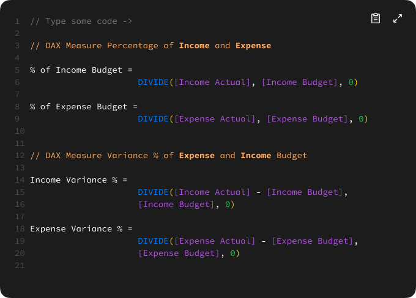

# Financial Reporting

## 1. Introduction
This financial dashboard provides a comprehensive overview of actual income and expenses compared to the allocated budget from 2019 - 2024. It consolidates data from both transaction and budget records to monitor financial performance across various projects and account categories. Key indicators such as budget variance, budget utilization rate, and monthly trends enable quick identification of underperforming income sources and over- or under-spending areas. The dashboard also supports project-level analysis, offering insights into revenue and cost efficiency. With interactive visuals and variance breakdowns, it serves as a valuable tool for informed financial decision-making and strategic budget management.

## 2. Problem Statement
Effective financial management requires timely and accurate insights into how actual income and expenses align with budgeted expectations. However, discrepancies often arise due to fluctuating revenues, unanticipated costs, and inefficient allocation of financial resources across projects. Without clear visibility into these variances, organizations risk overspending, underperformance, and missed financial targets. By leveraging budget-to-actual comparisons, trend analysis, and project-level breakdowns, this financial dashboard aims to enhance transparency and support data-driven decision-making.

This analysis focuses on:
- Comparing actual income and expenses against budgeted amounts.
- Identifying projects or accounts with the highest positive or negative variance.
- Measuring budget utilization rates for revenue and cost categories.
- Analyzing income and expense trends over multiple years.
- Evaluating financial efficiency and spending patterns across different classifications.

## 3. Skills Demonstrated
- **Data Cleaning & Transformation** using Power Query
- **DAX Measures** for advanced calculations
- **Interactive Dashboards** using Power BI visualizations
- **Power Query**: Using Power Query to clean, transform, and shape raw data into an analysis-ready format, ensuring accuracy and consistency.
- **Power BI Parameters**: Implemented a dynamic parameter allowing users to select different delay and flight categories . This enhances interactivity and enables focused analysis based on user selection.

## 4. Data Sourcing
The dataset used in this project consists of airline delay data, including:
- Project ID details (Income & Expense Actual, Income & Expense Budget, Income & Expense Variance Percentage)
- Comparison (Income Actual vs Income Budget and Expence Actual vs Expense Budget)

## 5. Data Transformation
Data preprocessing was performed using Power Query, including:
- Cleaning and structuring data
- Creating a Calendar table for time-based analysis
- Adding an Airport table with `Airport Code`, `Airport Name`, and `Airport Location`
- Adding a Carrier table with `Carrier Name` and `Carrier SVG Image`

## 6. DAX Measures
Here are some DAXs used for financial analysis:

#### Calculate Total and Average

#### Calculate Variance

