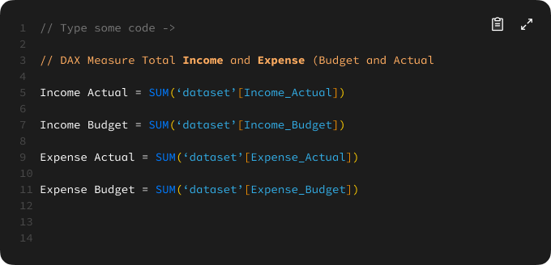
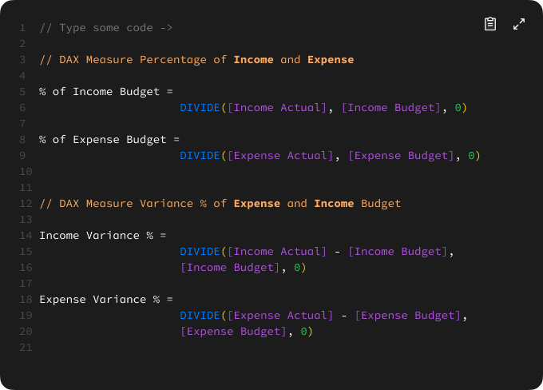
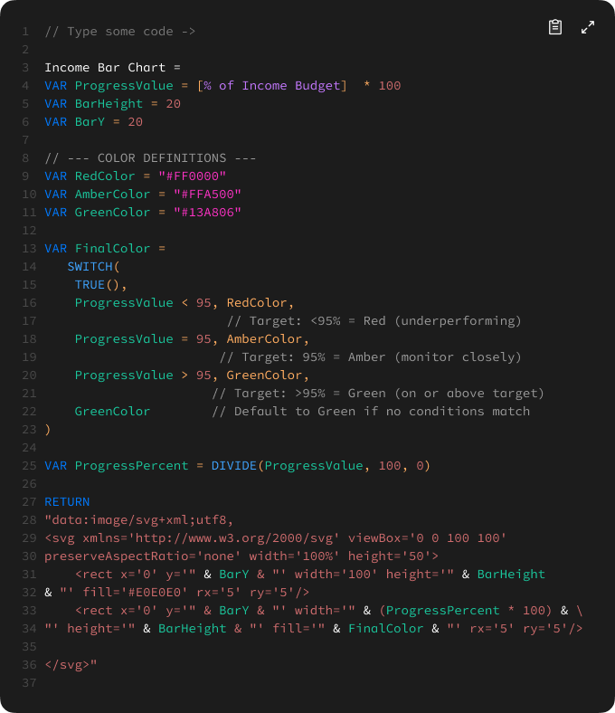
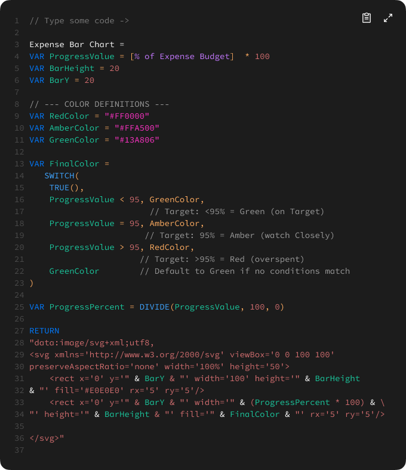
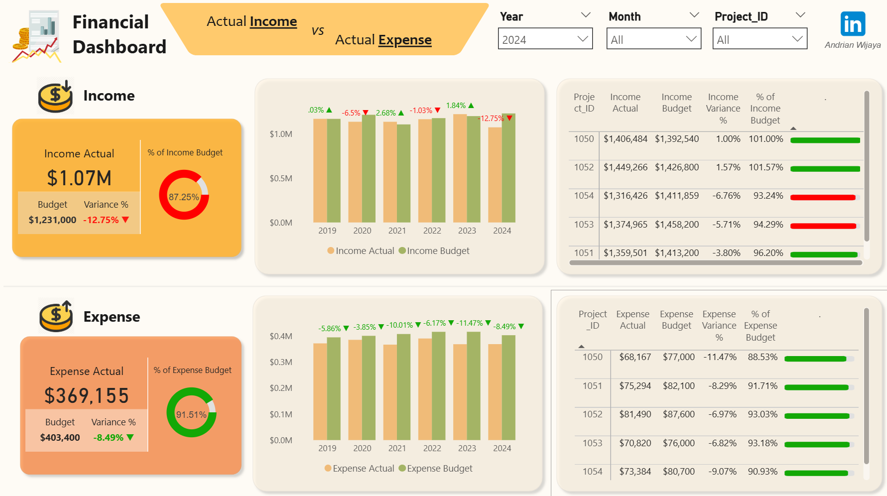

# Financial Project Reporting

## 1. Introduction
This financial project dashboard provides a comprehensive overview of actual income and expenses compared to the allocated budget from 2019 - 2024. It consolidates data from both transaction and budget records to monitor financial performance across various projects and account categories. Key indicators such as budget variance, budget utilization rate, and monthly trends enable quick identification of underperforming income sources and over- or under-spending areas. The dashboard also supports project-level analysis, offering insights into revenue and cost efficiency. With interactive visuals and variance breakdowns, it serves as a valuable tool for informed financial decision-making and strategic budget management.

## 2. Problem Statement
Effective financial management requires timely and accurate insights into how actual income and expenses align with budgeted expectations. However, discrepancies often arise due to fluctuating revenues, unanticipated costs, and inefficient allocation of financial resources across projects. Without clear visibility into these variances, organizations risk overspending, underperformance, and missed financial targets. By leveraging budget-to-actual comparisons, trend analysis, and project-level breakdowns, this financial dashboard aims to enhance transparency and support data-driven decision-making.

This analysis focuses on:
- Comparing actual income and expenses against budgeted amounts.
- Identifying projects or accounts with the highest positive or negative variance.
- Measuring budget utilization rates for revenue and cost categories.
- Analyzing income and expense trends over multiple years.
- Evaluating financial efficiency and spending patterns across different classifications.

## 3. Skills Demonstrated
- **Data Cleaning & Transformation** using Power Query
- **DAX Measures** for advanced calculations
- **Interactive Dashboards** using Power BI visualizations
- **Power Query**: Using Power Query to clean, transform, and shape raw data into an analysis-ready format, ensuring accuracy and consistency.
- **Power BI Parameters**: Implemented a dynamic parameter allowing users to select different delay and flight categories . This enhances interactivity and enables focused analysis based on user selection.

## 4. Data Sourcing
The dataset used in this project consists of airline delay data, including:
- Project ID details (Income & Expense Actual, Income & Expense Budget, Income & Expense Variance Percentage)
- Comparison (Income Actual vs Income Budget and Expence Actual vs Expense Budget)

## 5. Data Transformation
Data preprocessing was performed using Power Query, including:
- Cleaning and structuring data
- Creating a Calendar table for time-based analysis
- Adding an Airport table with `Airport Code`, `Airport Name`, and `Airport Location`
- Adding a Carrier table with `Carrier Name` and `Carrier SVG Image`

## 6. DAX Measures
Here are some DAXs used for financial analysis:

#### Calculate Total and Average

#### Calculate Variance and Variance Percentage of Income and Expense (Actual and Budget)

#### Customizing Bar Chart (Income)

#### Customizing Bar Chart (Expense)

## 7. Analysis & Visualization
Key insights were extracted using Power BI visualizations and DAX measures, including:
- **KPIs:** Income and Budget Rate, Ratio of Income and Expense (Actual and Budget), and Project ID Details
- **Bar Charts & Line Charts** for trend analysis

In this Dashboard there is a page :
- Overview

## 8. Insight
🔶 Income Overview
  - Actual Income: $1.07M vs Budgeted Income: $1.231M → -12.75% variance (underperformed)
  - Only 87.25% of the income budget was achieved.
  - The worst performance in the last 6 years, reversing the upward trend from 2021–2023.

- Income by Project:
  - Overperformed Projects:
    - Project 1050: +1.00% ($1,406,484 vs $1,392,540)
    - Project 1052: +1.57% ($1,449,266 vs $1,426,800)

  - Underperformed Projects:
    - Project 1051: -3.80%
    - Project 1053: -5.71%
    - Project 1054: -6.76% (worst performing)

🔷 Expense Overview
  - Actual Expense: $369,155 vs Budgeted Expense: $403,400 → -8.49% variance (underspent)
  - Only 91.51% of the expense budget was used.
  - This is consistent with a multi-year trend of expense efficiency (spending under budget since 2019).

- Expense by Project:
  - All projects spent below their allocated budgets, with variance ranging from -6.82% to -11.47%.
  - Project 1050 had the largest underspend: -11.47%
 
📊 Trends and Patterns
- Negative income trend in 2024 broke the previously improving trend seen in 2021–2023.
- Expense control remains strong, showing continued operational efficiency.
- Discrepancy between income underperformance and expense underspending suggests a potential issue in revenue generation rather than cost control.

## 9. Summary of Recommendations
- Investigate the cause of income shortfall, particularly for Projects 1053 and 1054.
- Reassess income projections for future years—2024 targets may have been overly optimistic.
- Maintain current expense management strategies, as budgets are being well controlled.

---
### Repository Contents  
- **Power BI Dashboard File**: The main [PBIX File](Project Actual vs Budget.pbix) containing the analysis and visualizations. 
- **Data Sources**: [Raw Dataset](Project_Monthly_Performance_2019_2024.xlsx) used in the project.  
- **Screenshots/Reports**: Exported visualizations for sharing insights.  
- **README.md**: Project documentation (this file).
